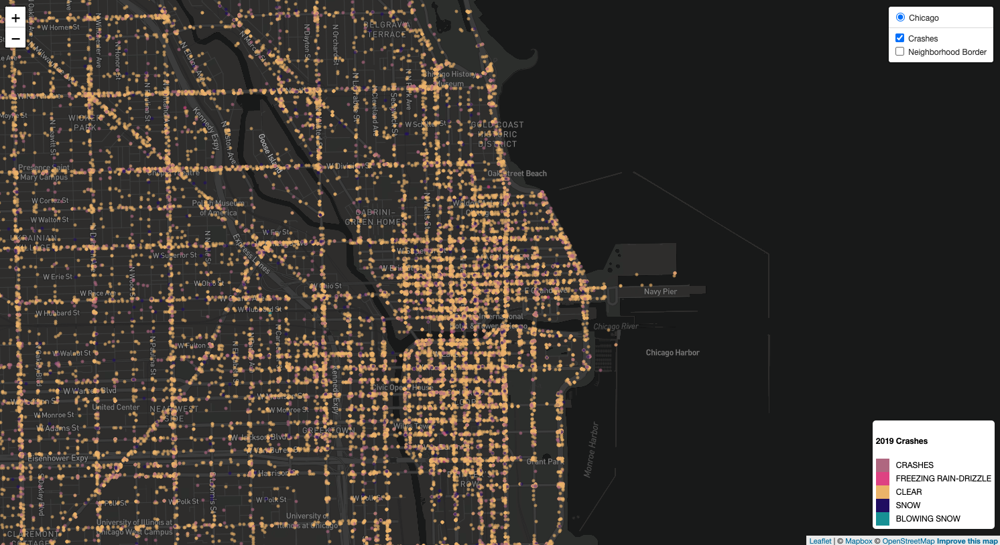
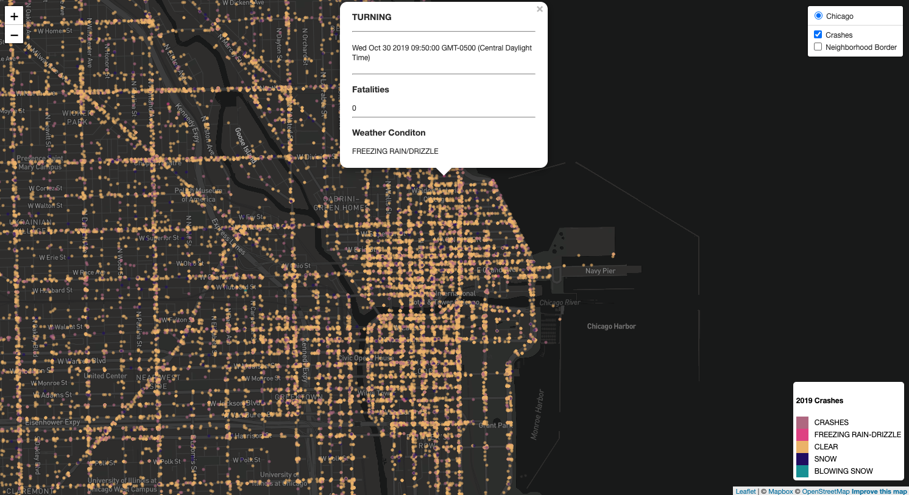
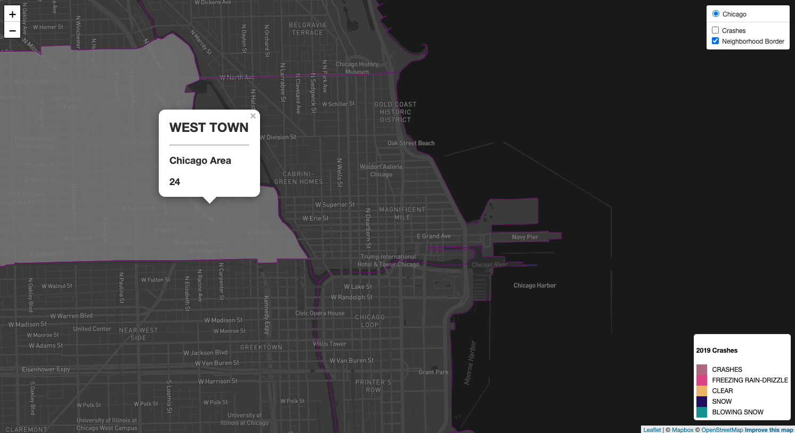

# Chicago Vehicle Crashes July 30th 2019 - December 31st 2019
[Visit my map HERE!](https://gitgranthub.github.io/chicago_2019_crash_data_project/)
---
[Visit our group project site HERE!](https://dr-harmony.github.io/geoproject.io/index.html)
* jupyter lab
* Javascript
* leaflet.js
* MapBox
* HTML
* D3.js

----
----
This leafletjs driven map displays crashes within the Chicago city limits for the 2nd half of 2019. Each crash corresponds to a color coded dot. The dot color indicates if it was clear, snowing, freezing rain, etc. Each dot is clickable and displays crash data; type of crash, time/date, fatalites, and weather condition.

To create this map I first started with a data pull from the Socrata API client and Chicago Data Portal, using a secure token. The original data consisted of 447,372 rows/entries and 49 columns of Chicago crash data from 2013-2020. This dataset was too large to map, so it was cleaned and parsed in Jupyter Lab. The result was a dataset from 2nd half of 2019 48,654 rows and 6 columns.
I then used the GeoPandas library to export a geoJSON file to use in populating the map. The crash geoJSON file was large, so I used another python script, “minify-geojson”https://github.com/TNOCS/minify-geojson#readme, to shrink the geoJSON file by close to 40%.

The logic.js file was built with two geoJSON layers. One layer displays the Chicago neighborhood borders for reference. The second layer displays all the crashes from 2019.

Version 2.0 of this map would have color coded neighborhoods(Choropleth), based on a chosen crash property. There is no correlating data point in the two datasets, so I began using a Chicago Neighborhood parser script found here https://github.com/jkgiesler/parse-chicago-neighborhoods. The parser is a very nice tool that appends a Chicago Area name next to your original Latitude and Longitude. The process would take some time to complete, because the reference data has neighborhoods named differently from the Chicago Areas dataset.

----
----

----
----
